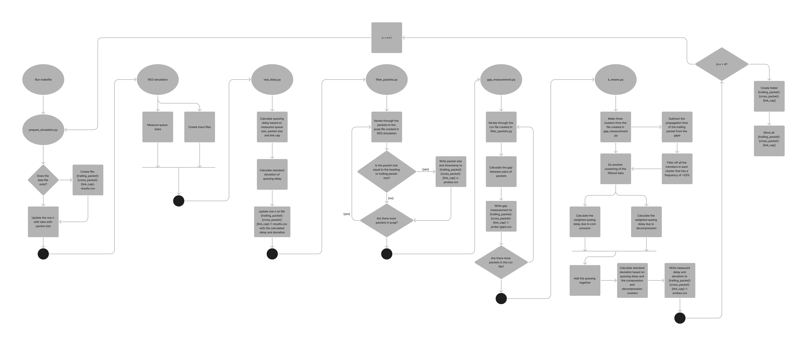

# User guide for queueing delay measurement

## File names and namin convetions
This project consist of multiple different parts, but can be broken into three
main categories:  
- NS3 Simulations which is responsible for creating the data that we analyze. Of
  which there are two programs:  
    - one-intermediate.cc which consists of a path with a single intermediate
      node.
    - three-intermediate.cc which consists of a path with three intermediate
      nodes.
- Data processing scrips, which transforms and measured the data captured in the
  NS3 simulations:    
    - ***prepare_simulation.py*** which either creates a new csv file/table, or
      adds a new row to an existing table.  
    - ***real_delay.py*** which calculates the delay and standard deviation
      based on the actual queue sizes of a given interface  
    - ***filter_packets.py*** Which filters out the probing packets from the
      other packets   
    - ***k_means.py*** Which uses the kmeans++ algorithm to estimate the
      queueing delays   
- Data files (csv and pcap), which contains data about the simulations, and
  different steps in the data processing.  
    All these files starts with a prefix which is defined like this:  
    - ***[trailing packet size]-[cross traffic packet size]-[link capasity (in
      Mbps)]-[simulation run]***  
    Then a suffix based on which part of measurement process it belongs to:  
    - ***results.csv*** contains packet information, link capasity, measured delay,
      measured standard deviation, the real delay, and real standard deviation.  
    - ***[one/three]-intermediate-1-2.pcap*** which is the tracefiles created by the
      simulation itself, and contain information about all the packets sent. 
    - ***queue-size.csv*** which is a measurement of the size of the queue which is
      done during the simulation. This value is used to calculate the real
      delay/standard deviation.  
    - ***probes-[one/three].csv*** contains all the timestamps for all the probing
      packets, after they have been filtered out in ***filter_packets.py***  
    - ***probe-gaps.csv*** which contains the measured distance between pairs of
      heading and trailing packets, this is used to estimate the queuing delay
      and standard deviation in ***k_means.py***

## How to run   
1. Navigate to the ns-3.39 directory.  
2. Run "make build" which builds the project and enable debugging and testing.  
3. In the top of the Makefile you will see four variables:  
    - LEADING_PACKET  
    - TRAILING_PACKET  
    - TRAFFIC_PACKET  
    - LINK_CAP  

    Change the values of these to simulate different combinations of packet
    sizes and link capasities.
4. Run the simulation you want:
    - "make completeSimulation1" will run the entire pipeline on a signle hop
      topology  
    (Five simulations with 500 packet pairs each).  
    - "make simulateAndMeasureDelay1" will run a single simulation with 500
      packet pairs.   
    This is mainly used for testing purposes.

## The pipeline one intermediate node

1. Set packet sizes and link capasity in the top of the Makefile  
2. Run a simulation (Make (completeSimulation1))  
3. prepare_simulation.py runs 
    - (if this is the first simulation run) Creates a file with the naming convention mentioned in ***File names and namin convetions***  
    - Updates the row in the file created, on the row corresponding to the simulation run with packet informatiom and link capasity.  
3. one-intermediate.cc runs  
    - 500 probing pairs are sent with with a distance of 50 - 250 ms between each pair.  
    - Queue sizes are measured every 5 micro seconds, 400 times and the queue size at each measurement is written to the ***queue-size.csv*** file.  
    - All packets being sent (including cross traffic packets) are traced and results in ***[trailing packet size]-[cross traffic packet size]-[link capasity (in
      Mbps)]-[simulation run]-one-intermediate-1-2.pcap*** which is all the packets that reaches node threes interface connected to node two.  
4. filter_packets.py runs  
    - All packets with size 64 bytes (Always the heading packet size) or the size of the trailing packet is filtered out, and the timestamp of their arrival at node 3 are written to the file probe file described in ***File names and namin convetions***.  
5. gap_measurement.py runs 
    - The gap between pairs of heading and trailing packets are calculated and written to the probe-gaps.csv file described in ***File names and namin convetions***.  
6. k_means.py runs  
    - The propagation delay of the trailing packet is subtracted from the measured gaps in the probe-gaps.csv file.  
    - The gaps are split into three clusters using the kmeans++ algorithm.   
    - The clusters are filtered, where all gaps in the cluster with a frequency <20% is removed.  
    - The clusters are reassigned with the filtered data.  
    - Queueing delay and standard deviation is calculated 
    - The results are written to the results.csv file, on the row corresponding to the simulation round.
7.steps 3 to 6 are repeated four more times.

## Kmeans clustering and measured queueing delay

